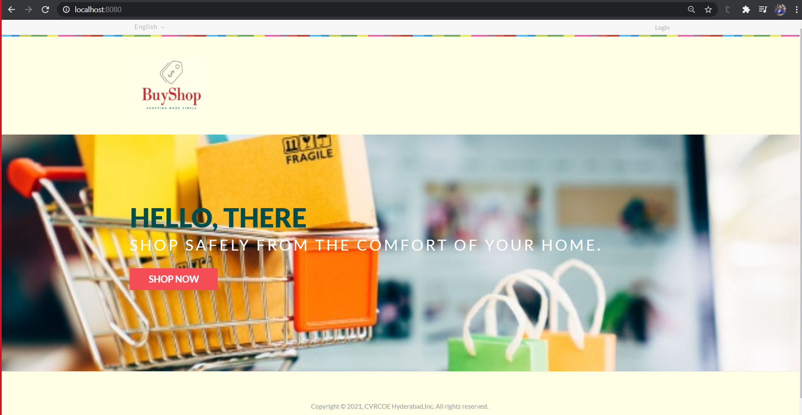

E-commerce Application using microservices (Major project)

Problem Statement Given by : CVR College Of Engineering,Vastunagar

This project outlines different aspects of developing an e-commerce website and the optimum solution to the challenges involved in developing one. It consists of the planning process, which starts with determining the use case, domain modeling, and architectural pattern of the web application. The entire development process is primarily divided into two parts: front-end development and back-end development. The database design is also discussed with an emphasis on its relational connectivity. This method of developing an e-commerce website can be easily replicated and followed in developing e-commerce websites in developing and underdeveloped countries where computing resources are scarce and expensive because of their socio-economic condition.

Here are some APPLICATION SCREENSHOTS,

Home page
The home page is the start page of the application.

